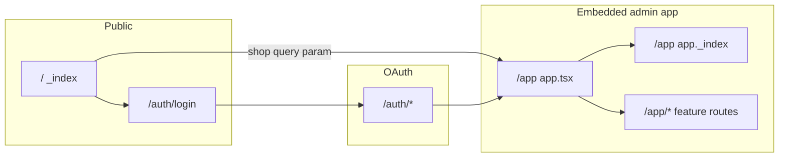

# SEO Suite (Remix) - Pages and features catalog

This document inventories **every Remix route**, the **embedded admin UI** under `/app`, **webhooks**, **theme extension** assets, and how they use **Shopify Admin GraphQL**, **Prisma**, and **Polaris / App Bridge**. It describes **what the code does today**, including mocks and placeholders.

---

## Table of contents

1. [App overview](#1-app-overview)
2. [Information architecture](#2-information-architecture)
3. [Route inventory](#3-route-inventory)
4. [Embedded app shell](#4-embedded-app-shell-apptsx)
5. [Per-page documentation](#5-per-page-documentation)
6. [Auth and public routes](#6-auth-and-public-routes)
7. [Webhooks](#7-webhooks)
8. [Server configuration](#8-server-configuration-shopifyserverts)
9. [Theme app extension](#9-theme-app-extension-extensionsseo-suite-schema)
10. [Prisma data models](#10-prisma-data-models)
11. [Cross-cutting dashboard logic](#11-cross-cutting-dashboard-logic)

---

## 1. App overview

| Item | Detail |
|------|--------|
| **Package name** | `seo-suite` ([`package.json`](../package.json)) |
| **Framework** | Remix with Vite ([`vite.config.ts`](../vite.config.ts)) |
| **UI** | Shopify Polaris, App Bridge (`AppProvider`, `NavMenu`, `TitleBar`) |
| **Auth / API** | `@shopify/shopify-app-remix` with **Admin API** `ApiVersion.January25` ([`app/shopify.server.ts`](../app/shopify.server.ts)) |
| **Database** | PostgreSQL via Prisma ([`prisma/schema.prisma`](../prisma/schema.prisma)) |
| **Routing** | File-based routes under [`app/routes/`](../app/routes/); [`app/routes.ts`](../app/routes.ts) exports `flatRoutes()` from `@remix-run/fs-routes` |

---

## 2. Information architecture

- **Merchant-facing storefront** JSON-LD is delivered by the **theme extension** (merchant adds the app block in the theme editor), not by the Remix app directly.

---

## 3. Route inventory

| Path (URL) | Route module | In `NavMenu` ([`app.tsx`](../app/routes/app.tsx)) | Primary purpose |
|------------|--------------|-----------------------------------------------------|-----------------|
| `/` | [`app/routes/_index/route.tsx`](../app/routes/_index/route.tsx) | No | Public landing; optional shop redirect |
| `/auth/login` | [`app/routes/auth.login/route.tsx`](../app/routes/auth.login/route.tsx) | No | Shop domain login form |
| `/auth/*` | [`app/routes/auth.$.tsx`](../app/routes/auth.$.tsx) | No | OAuth / session handling (loader) |
| `/app` (layout) | [`app/routes/app.tsx`](../app/routes/app.tsx) | - | Polaris + App Bridge shell, nav, outlet |
| `/app` (index) | [`app/routes/app._index.tsx`](../app/routes/app._index.tsx) | Yes (home) | SEO dashboard, score, history |
| `/app/seo-audit` | [`app/routes/app.seo-audit.tsx`](../app/routes/app.seo-audit.tsx) | Yes | Per-resource audit table |
| `/app/meta-tags` | [`app/routes/app.meta-tags.tsx`](../app/routes/app.meta-tags.tsx) | Yes | SEO fields for products, collections, pages |
| `/app/image-optimization` | [`app/routes/app.image-optimization.tsx`](../app/routes/app.image-optimization.tsx) | Yes | Product image alt text (media update) |
| `/app/image-compression` | [`app/routes/app.image-compression.tsx`](../app/routes/app.image-compression.tsx) | Yes | Simulated compression UI |
| `/app/content-optimization` | [`app/routes/app.content-optimization.tsx`](../app/routes/app.content-optimization.tsx) | Yes | Product description HTML + mock AI |
| `/app/llms-seo` | [`app/routes/app.llms-seo.tsx`](../app/routes/app.llms-seo.tsx) | Yes | `llms.txt` file + `/llms.txt` redirect |
| `/app/schema-markup` | [`app/routes/app.schema-markup.tsx`](../app/routes/app.schema-markup.tsx) | Yes | Shop metafield for schema toggles (admin) |
| `/app/internal-linking` | [`app/routes/app.internal-linking.tsx`](../app/routes/app.internal-linking.tsx) | Yes | Suggested internal links (simulated apply) |
| `/app/broken-links` | [`app/routes/app.broken-links.tsx`](../app/routes/app.broken-links.tsx) | Yes | Parse HTML links vs product handles |
| `/app/sitemap-robots` | [`app/routes/app.sitemap-robots.tsx`](../app/routes/app.sitemap-robots.tsx) | Yes | Informational sitemap + robots editor UI |
| `/app/bulk-editor` | [`app/routes/app.bulk-editor.tsx`](../app/routes/app.bulk-editor.tsx) | Yes | Bulk product SEO title/description |
| `/app/automations` | [`app/routes/app.automations.tsx`](../app/routes/app.automations.tsx) | Yes | CRUD-ish automation schedules (DB) |
| `/app/ai-settings` | [`app/routes/app.ai-settings.tsx`](../app/routes/app.ai-settings.tsx) | Yes | AI prompt templates (DB) |
| `/app/pricing` | [`app/routes/app.pricing.tsx`](../app/routes/app.pricing.tsx) | Yes | Billing check + subscribe (test mode) |
| `/app/additional` | [`app/routes/app.additional.tsx`](../app/routes/app.additional.tsx) | **No (orphan)** | Shopify template “additional page” copy |
| `POST` webhooks | [`webhooks.app.uninstalled.tsx`](../app/routes/webhooks.app.uninstalled.tsx), [`webhooks.app.scopes_update.tsx`](../app/routes/webhooks.app.scopes_update.tsx) | No | Session lifecycle |

---

## 4. Embedded app shell (`app.tsx`)

**Path:** `/app` (parent)  
**File:** [`app/routes/app.tsx`](../app/routes/app.tsx)

| Area | Detail |
|------|--------|
| **Loader** | `authenticate.admin(request)`; returns `SHOPIFY_API_KEY` for `AppProvider`. |
| **UI** | `AppProvider` (embedded), full-screen loading overlay during `useNavigation()` transitions, `NavMenu` links (all feature routes + Pricing), `Outlet` for children. |
| **Styles** | Imports Polaris CSS. |
| **Error / headers** | Uses `boundary.error` / `boundary.headers` from `@shopify/shopify-app-remix/server`. |
| **Persistence** | None. |

---

## 5. Per-page documentation

Template for each route below: **Path**, **File**, **Navigation**, **Loader**, **Actions**, **UI**, **Persistence**, **Implementation status**.

### 5.1 Dashboard

- **Path:** `/app`  
- **File:** [`app/routes/app._index.tsx`](../app/routes/app._index.tsx)  
- **Navigation:** Yes (`rel="home"` → Dashboard)

**Loader**

- GraphQL: `products(first: 50)` with `seo`, `images.altText`; `pages(first: 50)`; `articles(first: 50)` with `body`.
- Computes: overall SEO score, `metaIssuesCount`, `missingAltCount`, `brokenLinksCount` (regex on article/page HTML vs product handles; uses hardcoded `https://yourstore.com/products/` pattern), `duplicateContentCount` (duplicate product SEO titles).
- Prisma: reads latest `AuditHistory`; if none or older than ~24h, **creates** new `AuditHistory` row; loads last 7 `AuditHistory` rows for simple history UI.

**Actions**

- None (scan button triggers client `revalidator.revalidate()`).

**UI**

- TitleBar “SEO Suite Dashboard”; overall score with animated progress; health cards linking to Meta Tags, Image Alt, Broken Links, SEO Audit; module list; history display.

**Persistence**

- `AuditHistory` (writes throttled ~24h per shop).

**Implementation status**

- Broken-link count shares the same **simplified** heuristic as the Broken Links page (internal `/products/` only; placeholder domain string).
- No use of `BrokenLinkLog` or `StoreSettings` here.

---

### 5.2 SEO Audit

- **Path:** `/app/seo-audit`  
- **File:** [`app/routes/app.seo-audit.tsx`](../app/routes/app.seo-audit.tsx)  
- **Navigation:** Yes

**Loader**

- GraphQL: `products(first: 50)` (`seo`, images `altText`); `pages(first: 50)` (`title` only).
- Builds `auditResults`: per product and per page score, issues list, badge status, `actionLink` to `/app/image-optimization` or `/app/meta-tags`.

**Actions**

- None.

**UI**

- DataTable of audits, average score, “scan” UX with progress (revalidate).

**Persistence**

- None.

**Implementation status**

- Page SEO in Shopify is approximated by title length only (comment in code notes Admin API limitations).

---

### 5.3 Meta Tags

- **Path:** `/app/meta-tags`  
- **File:** [`app/routes/app.meta-tags.tsx`](../app/routes/app.meta-tags.tsx)  
- **Navigation:** Yes

**Loader**

- Cursor pagination via query params: `productCursor`, `collectionCursor`, `pageCursor`, `*Direction`.
- GraphQL: `products`, `collections`, `pages` (50 per page) with `seo`, descriptions, images; pages include `metafields(namespace: "global")` for display.

**Actions**

- `intent === "bulk_optimize"`: For each selected ID, fetches title by resource type, **simulates AI** (`setTimeout` 800ms), applies **template** title/description strings, then:
  - `productUpdate` / `collectionUpdate` with `seo`
  - `pageUpdate` with `metafields` `global.title_tag` / `global.description_tag`
- Default branch: single save with same mutations from form `seoTitle` / `seoDescription`.

**UI**

- Tabs (Products / Collections / Pages), `IndexTable`, thumbnails, bulk optimize, per-row edit/save, pagination controls.

**Persistence**

- Shopify resources only (no Prisma).

**Implementation status**

- “AI” bulk optimize is **deterministic template text**, not an external model.

---

### 5.4 Image optimization (alt text)

- **Path:** `/app/image-optimization`  
- **File:** [`app/routes/app.image-optimization.tsx`](../app/routes/app.image-optimization.tsx)  
- **Navigation:** Yes (“Image Alt Text”)

**Loader**

- Cursor pagination on `products`; each product up to 5 images; builds flat `images` list with `productId`, `productTitle`.

**Actions**

- `intent === "bulk_optimize"`: Pattern `product_name` | `product_name_store_name` | AI (simulated): resolves **Image** id → **MediaImage** id via `product { media { ... on MediaImage } }`, then `productUpdateMedia` with new `alt`.
- Single save: same media resolution + `productUpdateMedia`.

**UI**

- Index table, selection, pattern / AI choice, modal for single image edit, pagination.

**Persistence**

- Shopify product media only.

**Implementation status**

- Non-pattern “AI” alt is a **fixed generic string** after delay.

---

### 5.5 Image compression

- **Path:** `/app/image-compression`  
- **File:** [`app/routes/app.image-compression.tsx`](../app/routes/app.image-compression.tsx)  
- **Navigation:** Yes

**Loader**

- Products (20 per page) with images; **estimates** KB size from width × height (comment: demo only).

**Actions**

- `intent === "bulk_compress"`: **No `authenticate.admin`** in action; `setTimeout` 2s; returns fake `savedKb` (~60% of estimated size × count). Does not call Shopify file APIs.

**UI**

- Format/quality `Select`, index table, compress button, success banner.

**Persistence**

- None.

**Implementation status**

- **Fully simulated**; comments describe a future `sharp` + `stagedUploadsCreate` pipeline.

---

### 5.6 AI content optimization

- **Path:** `/app/content-optimization`  
- **File:** [`app/routes/app.content-optimization.tsx`](../app/routes/app.content-optimization.tsx)  
- **Navigation:** Yes (“AI Content”)

**Loader**

- Paginated `products` with `descriptionHtml`, featured image.

**Actions**

- `bulk_optimize`: Loop selected IDs - fetch title, **simulate** delay, **template** HTML paragraph, `productUpdate` `descriptionHtml`.
- `generate`: keyword + tone → **mock** paragraphs (`professional` / `casual` / `humorous` / default) after 1.5s delay.
- `save`: `productUpdate` with `descriptionHtml` from form.

**UI**

- Index table, bulk optimize, modal / editor flow for generate + save.

**Persistence**

- Shopify products only.

**Implementation status**

- No external LLM; `generate` intent is explicitly mocked in code.

---

### 5.7 LLMs SEO (`llms.txt`)

- **Path:** `/app/llms-seo`  
- **File:** [`app/routes/app.llms-seo.tsx`](../app/routes/app.llms-seo.tsx)  
- **Navigation:** Yes

**Loader**

- GraphQL: `shop { name description url }`, recent `products`, `collections`, `pages`, `articles` (with blog handle); `urlRedirects(first: 1, query: "path:/llms.txt")` for existing redirect.

**Actions**

- Full pipeline: `stagedUploadsCreate` → POST file → `fileCreate` → poll `node` for `GenericFile.url` → `urlRedirectCreate` or `urlRedirectUpdate` for path `/llms.txt` → target file URL.

**UI**

- Text area for `llms.txt`, auto-generate from shop/product data, publish button, banners for success/errors.

**Persistence**

- Shopify Files + URL redirects only.

**Implementation status**

- **Real** Admin API usage for upload and redirect (not mocked).

---

### 5.8 Schema markup (admin)

- **Path:** `/app/schema-markup`  
- **File:** [`app/routes/app.schema-markup.tsx`](../app/routes/app.schema-markup.tsx)  
- **Navigation:** Yes (“Schema”)

**Loader**

- GraphQL: `shop.metafield(namespace: "seo_suite", key: "schema_config")`; parses JSON or defaults `{ product, breadcrumb, faq, article }` statuses.

**Actions**

- Parses `currentConfig` from form; sets schema key to `active` / `inactive`; `metafieldsSet` on shop for same namespace/key as JSON.

**UI**

- Cards / modals for schema types (product, breadcrumb, FAQ, article), inject/remove toggles, banners.

**Persistence**

- Shop metafield `seo_suite.schema_config`.

**Implementation status**

- **Theme extension** ([§9](#9-theme-app-extension-extensionsseo-suite-schema)) uses **theme block settings**, not this metafield - admin toggles and storefront JSON-LD are **not wired together** in the current codebase.

---

### 5.9 Internal linking

- **Path:** `/app/internal-linking`  
- **File:** [`app/routes/app.internal-linking.tsx`](../app/routes/app.internal-linking.tsx)  
- **Navigation:** Yes

**Loader**

- GraphQL: `products(first: 10)`, `articles(first: 5)` with `body`.
- Builds Cartesian **suggestions** per article × product; `status` = `applied` if `body` already contains `href="/products/{handle}"`.

**Actions**

- `intent === "bulk_link"`: `setTimeout` 2s, returns success count - **does not** mutate article HTML in Shopify.

**UI**

- Index table, bulk link button, scanning UI state.

**Persistence**

- None.

**Implementation status**

- Apply action is **simulated**.

---

### 5.10 Broken links

- **Path:** `/app/broken-links`  
- **File:** [`app/routes/app.broken-links.tsx`](../app/routes/app.broken-links.tsx)  
- **Navigation:** Yes

**Loader**

- GraphQL: `articles(first: 20)`, `pages(first: 20)`, `products(first: 50)` handles.
- Regex-parse `href` in HTML; treats `/products/...` or `https://yourstore.com/products/...` as internal; flags missing handles.

**Actions**

- `bulk_unlink`: **No auth**; `setTimeout` 2s - does not update Shopify content.

**UI**

- Index table, bulk unlink, refresh/revalidate.

**Persistence**

- None (Prisma model `BrokenLinkLog` exists in schema but is **unused** in `app/`).

**Implementation status**

- Detection is **narrow** (product URLs + placeholder domain); fix is **simulated**.

---

### 5.11 Sitemap and robots

- **Path:** `/app/sitemap-robots`  
- **File:** [`app/routes/app.sitemap-robots.tsx`](../app/routes/app.sitemap-robots.tsx)  
- **Navigation:** Yes

**Loader**

- None.

**Actions**

- None.

**UI**

- Local React state for default `robots.txt` text; “Submit to Google Search Console” button runs **client** `setTimeout` only; informational card about Shopify `/sitemap.xml`.

**Persistence**

- None (does not write `robots.txt` or metafields).

**Implementation status**

- **Placeholder** UX; GSC integration not implemented.

---

### 5.12 Bulk editor

- **Path:** `/app/bulk-editor`  
- **File:** [`app/routes/app.bulk-editor.tsx`](../app/routes/app.bulk-editor.tsx)  
- **Navigation:** Yes

**Loader**

- Paginated `products` with `seo` title/description.

**Actions**

- Parses JSON `updates` array; sequential `productUpdate` with `seo` per item; collects errors.

**UI**

- Inline text fields per product, select rows, save, pagination.

**Persistence**

- Shopify products only.

**Implementation status**

- **Real** mutations; sequential loop (rate-limit note in code).

---

### 5.13 Automations

- **Path:** `/app/automations`  
- **File:** [`app/routes/app.automations.tsx`](../app/routes/app.automations.tsx)  
- **Navigation:** Yes

**Loader**

- `ScheduledAutomation.findMany` for shop.

**Actions**

- `toggle`: flip `active` / `paused`.
- `create`: upsert by `type` (update frequency or create row) with `type` + `frequency` from form (`seo_audit`, etc.).

**UI**

- Select type/frequency, create button, index table with toggle.

**Persistence**

- `ScheduledAutomation`.

**Implementation status**

- **No background worker** or cron in this repo reads `nextRunAt` / runs scans - records are stored only.

---

### 5.14 AI settings

- **Path:** `/app/ai-settings`  
- **File:** [`app/routes/app.ai-settings.tsx`](../app/routes/app.ai-settings.tsx)  
- **Navigation:** Yes

**Loader**

- `AIPromptTemplate.findMany` for shop.

**Actions**

- `create` / `update`: save name, description, template body, tone.
- `delete`: remove template.

**UI**

- Index table, modal for create/edit with default placeholder template string.

**Persistence**

- `AIPromptTemplate`.

**Implementation status**

- Templates are **not referenced** by Meta Tags / Content pages in current code (those use inline mock text).

---

### 5.15 Pricing

- **Path:** `/app/pricing`  
- **File:** [`app/routes/app.pricing.tsx`](../app/routes/app.pricing.tsx)  
- **Navigation:** Yes

**Loader**

- `authenticate.admin` with `billing`; `billing.check()`; `StoreSettings.upsert` with `plan` string from subscription name or “Free”.

**Actions**

- `billing.request` for plan **Basic** or **Pro** with `isTest: true` and constructed `returnUrl` (uses `SHOP_CUSTOM_DOMAIN` or admin host pattern).

**UI**

- Plan cards, feature lists, subscribe buttons.

**Persistence**

- `StoreSettings.plan` (synced from billing check).

**Implementation status**

- Plans must match keys in [`shopify.server.ts`](../app/shopify.server.ts) (`Basic`, `Pro`). Other `StoreSettings` fields (`aiTokensUsed`, etc.) exist in schema but are **not** used in routes reviewed.

---

### 5.16 Additional page (orphan)

- **Path:** `/app/additional`  
- **File:** [`app/routes/app.additional.tsx`](../app/routes/app.additional.tsx)  
- **Navigation:** **No**

**Loader / Actions**

- None.

**UI**

- Static template explaining App Bridge navigation; references `app.jsx` in copy (project uses `.tsx`).

**Persistence**

- None.

---

## 6. Auth and public routes

### 6.1 Public index `/`

**File:** [`app/routes/_index/route.tsx`](../app/routes/_index/route.tsx)

- **Loader:** If `?shop=` present, `redirect` to `/app` with same query; else returns `{ showForm: Boolean(login) }`.
- **UI:** Marketing placeholder (“A short heading about [your app]”) and optional POST to `/auth/login` for shop domain.
- **Persistence:** None.

### 6.2 Login `/auth/login`

**File:** [`app/routes/auth.login/route.tsx`](../app/routes/auth.login/route.tsx)

- **Loader / action:** `login(request)` from [`shopify.server.ts`](../app/shopify.server.ts); surfaces `loginErrorMessage` from helper [`app/routes/auth.login/error.server.tsx`](../app/routes/auth.login/error.server.tsx) (not a route module-shared server util for login errors).
- **UI:** Polaris standalone `Page` / `Form` / shop `TextField`.

### 6.3 Auth catch-all `/auth/*`

**File:** [`app/routes/auth.$.tsx`](../app/routes/auth.$.tsx)

- **Loader:** `authenticate.admin(request)` then returns `null` (embedded auth handoff pattern for this template).

---

## 7. Webhooks

### 7.1 App uninstalled

**File:** [`app/routes/webhooks.app.uninstalled.tsx`](../app/routes/webhooks.app.uninstalled.tsx)

- **Action:** `authenticate.webhook`; if `session` present, `db.session.deleteMany({ where: { shop } })`.
- **Persistence:** `Session` rows removed for shop.

### 7.2 Scopes updated

**File:** [`app/routes/webhooks.app.scopes_update.tsx`](../app/routes/webhooks.app.scopes_update.tsx)

- **Action:** `authenticate.webhook`; reads `payload.current` string array; if `session`, `db.session.update` sets `scope` to `current.toString()`.
- **Persistence:** `Session.scope`.

---

## 8. Server configuration (`shopify.server.ts`)

**File:** [`app/shopify.server.ts`](../app/shopify.server.ts)

- **`shopifyApp`:** `apiKey`, `apiSecretKey`, `apiVersion: January25`, `scopes` from `SCOPES` env, `appUrl`, `authPathPrefix: "/auth"`, `distribution: AppDistribution.AppStore`.
- **Session:** `PrismaSessionStorage(prisma)` ([`app/db.server.ts`](../app/db.server.ts)).
- **Future flags:** `unstable_newEmbeddedAuthStrategy`, `expiringOfflineAccessTokens`.
- **Billing:** `Basic` ($9.99 USD / 30 days), `Pro` ($29.99 USD / 30 days).
- **Optional:** `customShopDomains` from `SHOP_CUSTOM_DOMAIN`.
- **Exports:** `authenticate`, `login`, `registerWebhooks`, headers helper, etc.

---

## 9. Theme app extension (`extensions/seo-suite-schema`)

**Manifest:** [`extensions/seo-suite-schema/shopify.extension.toml`](../extensions/seo-suite-schema/shopify.extension.toml) - `type = "theme"`, name “SEO Suite Schema”.

| Asset | Role |
|-------|------|
| [`blocks/schema.liquid`](../extensions/seo-suite-schema/blocks/schema.liquid) | App block `target: "head"`; optional JSON-LD for **Product**, **BlogPosting** (article), **BreadcrumbList** (product/collection); settings: `enable_schema`, `enable_product_schema`, `enable_breadcrumb_schema`, `enable_article_schema`. |
| [`assets/schema.js`](../extensions/seo-suite-schema/assets/schema.js) | Placeholder (file contains a one-line comment only). |
| [`snippets/stars.liquid`](../extensions/seo-suite-schema/snippets/stars.liquid) | Supporting snippet (if referenced by theme). |
| [`locales/en.default.json`](../extensions/seo-suite-schema/locales/en.default.json) | Extension strings |

**Relation to admin Schema page:** The admin UI persists **`seo_suite.schema_config`** on the **shop**. The theme block does **not** read that metafield; toggles are **theme editor checkboxes**. Merchants configure storefront schema independently of the admin page unless you add Liquid/metafield wiring later.

---

## 10. Prisma data models

Defined in [`prisma/schema.prisma`](../prisma/schema.prisma). **Usage in app code:**

| Model | Used in |
|-------|---------|
| `Session` | Shopify session storage + uninstall webhook |
| `StoreSettings` | [`app.pricing.tsx`](../app/routes/app.pricing.tsx) (`plan` upsert) |
| `AuditHistory` | [`app._index.tsx`](../app/routes/app._index.tsx) |
| `BrokenLinkLog` | **Schema only** (no app references) |
| `AIPromptTemplate` | [`app.ai-settings.tsx`](../app/routes/app.ai-settings.tsx) |
| `ScheduledAutomation` | [`app.automations.tsx`](../app/routes/app.automations.tsx) |

---

## 11. Cross-cutting dashboard logic

The dashboard ([`app._index.tsx`](../app/routes/app._index.tsx)) duplicates **high-level** checks also shown on **SEO Audit** and **Broken Links**:

- Product meta and alt heuristics align with audit scoring.
- Broken link counting uses the same regex and **product-handle allowlist** approach.

**Audit history:** New row created at most about **once per 24 hours** per shop when the dashboard loader runs, to avoid unbounded rows.

---

## Document maintenance

When adding routes under [`app/routes/`](../app/routes/), update:

1. [Route inventory](#3-route-inventory)
2. [Per-page documentation](#5-per-page-documentation)
3. [`NavMenu`](../app/routes/app.tsx) if applicable
4. [Prisma](#10-prisma-data-models) if new models are used

---

*Generated to match repository behavior as of the last full pass over `app/routes/*.tsx` and `extensions/seo-suite-schema/`.*
